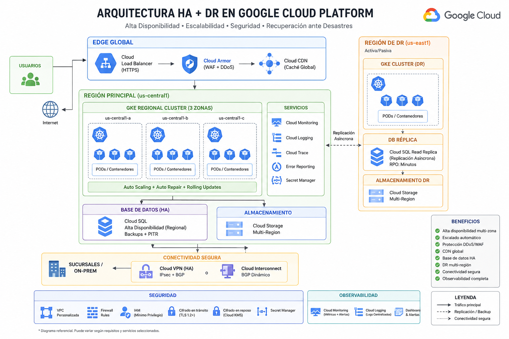

# ☁️ Arquitectura HA + DR en Google Cloud Platform (GCP)

Implementación de una arquitectura escalable, segura y altamente disponible para aplicaciones críticas usando servicios administrados de Google Cloud Platform.

---

# 📌 Objetivos

- Alta disponibilidad (HA)
- Escalabilidad automática
- Seguridad avanzada
- Recuperación ante desastres (DR)
- Baja latencia
- Observabilidad completa
- Infraestructura moderna basada en contenedores

---

## 🏗️ Arquitectura de Referencia

<p align="center">
  
</p>

---

# 🧩 Componentes Principales

| Componente | Servicio |
|---|---|
| Contenedores | GKE Regional |
| Balanceo | Cloud Load Balancer |
| Seguridad | Cloud Armor |
| CDN | Cloud CDN |
| Base de Datos | Cloud SQL HA / Spanner |
| DR | Multi-Region |
| Conectividad | Cloud VPN / Interconnect |
| Observabilidad | Cloud Monitoring + Logging |
| IaC | Terraform |

---

# 🚀 Paso 1 — Crear Proyecto

## Ruta
```text
IAM & Admin → Create Project
```

## Configuración
```text
Nombre: prod-restaurants-app
```

---

# 🔌 Paso 2 — Habilitar APIs

## Ruta
```text
APIs & Services → Enable APIs and Services
```

## APIs necesarias

- Kubernetes Engine API
- Compute Engine API
- Cloud SQL Admin API
- Cloud Monitoring API
- Cloud Logging API
- Cloud Build API
- Cloud DNS API

---

# 🌐 Paso 3 — Configurar Red VPC

## Ruta
```text
VPC Network → VPC Networks → Create VPC Network
```

## Configuración

### Tipo
```text
Custom
```

### VPC
```text
prod-vpc
```

---

## Subred Primaria

| Parámetro | Valor |
|---|---|
| Región | us-central1 |
| CIDR | 10.10.0.0/16 |

---

## Subred DR

| Parámetro | Valor |
|---|---|
| Región | us-east1 |
| CIDR | 10.20.0.0/16 |

---

# ☸️ Paso 4 — Crear Cluster GKE Regional

## Ruta
```text
Kubernetes Engine → Clusters → Create
```

## Configuración

| Parámetro | Valor |
|---|---|
| Tipo | Standard |
| Nombre | prod-gke |
| Región | us-central1 |
| Zonas | us-central1-a/b/c |

---

## Node Pools

| Configuración | Valor |
|---|---|
| Machine Type | e2-standard-4 |
| Autoscaling | Enabled |
| Min Nodes | 3 |
| Max Nodes | 10 |

---

## Seguridad

Activar:
- Shielded Nodes
- Workload Identity
- Auto-repair
- Auto-upgrade

---

# 📦 Paso 5 — Deploy de Aplicación

## Ruta
```text
Kubernetes Engine → Workloads → Deploy
```

## Configuración

| Parámetro | Valor |
|---|---|
| Imagen | gcr.io/proyecto/api:v1 |
| Puerto | 8080 |
| Réplicas | 3 |

---

## Health Checks

| Tipo | Endpoint |
|---|---|
| Liveness | /health |
| Readiness | /health |

---

## Estrategia
```text
Rolling Update
```

---

# 📈 Paso 6 — Configurar Autoscaling

## Ruta
```text
Kubernetes Engine → Workloads → Autoscaling
```

## Configuración

| Parámetro | Valor |
|---|---|
| CPU Threshold | 70% |
| Min Pods | 3 |
| Max Pods | 20 |

---

# ⚖️ Paso 7 — Configurar Load Balancer

## Ruta
```text
Network Services → Load Balancing
```

## Tipo
```text
HTTP(S) Load Balancer
```

## Configuración

| Configuración | Valor |
|---|---|
| Frontend | HTTPS |
| IP | Global Static IP |
| Backend | GKE Service |

---

# 🔒 Paso 8 — Configurar SSL

## Ruta
```text
Network Security → SSL Certificates
```

## Configuración

| Parámetro | Valor |
|---|---|
| Tipo | Google Managed |
| Dominio | app.midominio.com |

---

# 🛡️ Paso 9 — Configurar Cloud Armor (WAF)

## Ruta
```text
Network Security → Cloud Armor
```

## Configuración

### Crear Security Policy
```text
prod-waf-policy
```

---

## Reglas recomendadas

### Bloqueo geográfico
- China
- Rusia
- Países no requeridos

### Protección OWASP
- SQL Injection
- XSS
- LFI/RFI
- Bots

---

# ⚡ Paso 10 — Habilitar Cloud CDN

## Ruta
```text
Load Balancing → Backend Configuration
```

## Activar
```text
Enable Cloud CDN
```

---

# 🗄️ Paso 11 — Crear Base de Datos HA

# Opción A — Cloud SQL

## Ruta
```text
SQL → Create Instance
```

## Configuración

| Parámetro | Valor |
|---|---|
| Engine | PostgreSQL |
| HA | Regional |
| Región | us-central1 |

---

## Activar

- Automated Backups
- Point-in-Time Recovery (PITR)
- Binary Logging

---

# 🌎 Paso 12 — Configurar Replica DR

## Ruta
```text
Cloud SQL → Create Read Replica
```

## Configuración

| Parámetro | Valor |
|---|---|
| Región DR | us-east1 |

---

# 🔄 Paso 13 — Estrategia DR

## Arquitectura

| Región | Función |
|---|---|
| us-central1 | Producción |
| us-east1 | Disaster Recovery |

---

## Replicación

- Cloud SQL Read Replica
- Backups multi-región
- Artifact Registry replicado
- Terraform para reconstrucción rápida

---

# 🔐 Paso 14 — Conectividad Segura

# Opción A — Cloud VPN

## Ruta
```text
Hybrid Connectivity → VPN
```

## Configuración

- VPN HA
- IPsec
- BGP dinámico
- Failover automático

---

# Opción B — Dedicated Interconnect

Ideal para:
- Alto tráfico
- Baja latencia
- Muchas sucursales

---

# 🔥 Paso 15 — Firewalls y Seguridad

## Ruta
```text
VPC Network → Firewall
```

## Permitir

- HTTPS
- Health Checks
- VPN

---

## Bloquear

- Puertos inseguros
- Tráfico lateral
- Accesos innecesarios

---

# 👤 Paso 16 — IAM (Least Privilege)

## Ruta
```text
IAM & Admin → IAM
```

## Roles recomendados

- Viewer
- Monitoring Viewer
- Kubernetes Admin
- Cloud SQL Client

⚠️ Evitar uso excesivo de:
```text
Owner
```

---

# 📊 Paso 17 — Monitoring & Logging

## Ruta
```text
Operations → Monitoring
```

---

## Monitorear

- CPU
- Memoria
- Pods
- Errores
- Latencia
- VPN
- DB

---

## Alertas

- Pod Down
- CPU > 80%
- VPN caída
- Latencia alta
- DB failover

---

# 📝 Logging Centralizado

## Ruta
```text
Operations → Logging
```

## Logs importantes

- GKE
- Load Balancer
- Cloud Armor
- Auditoría IAM

---

# 🏆 Resultado Final

## Beneficios

✅ Alta disponibilidad multi-zona  
✅ Escalado automático  
✅ WAF + Anti-DDoS  
✅ CDN global  
✅ DR multi-región  
✅ Base de datos HA  
✅ Seguridad Zero Trust  
✅ Observabilidad completa  
✅ Rolling updates sin downtime  
✅ Infraestructura moderna y escalable  

---

# 📚 Tecnologías Utilizadas

- Google Kubernetes Engine (GKE)
- Cloud Load Balancer
- Cloud Armor
- Cloud CDN
- Cloud SQL
- Cloud VPN
- Cloud Monitoring
- Terraform

---

# 👨‍💻 Autor

**Jonas Carrillo Carballo**  
Cloud Infrastructure | DevOps | AWS | GCP | Linux | Observability
